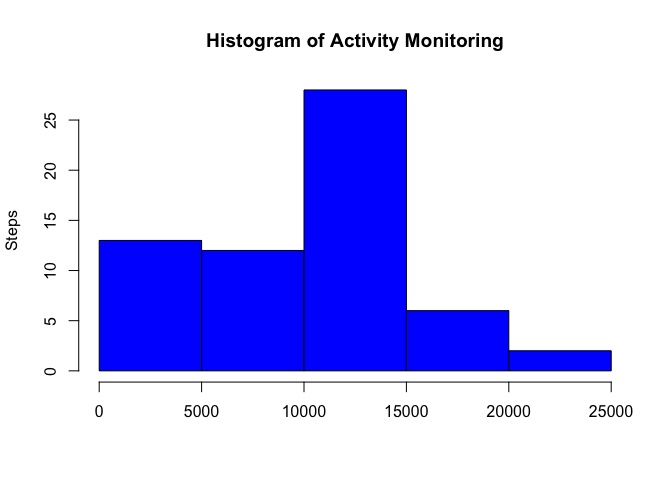
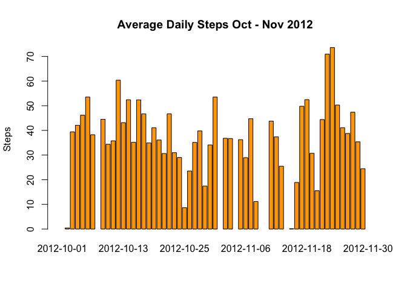
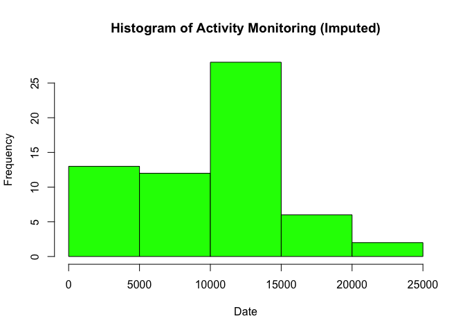
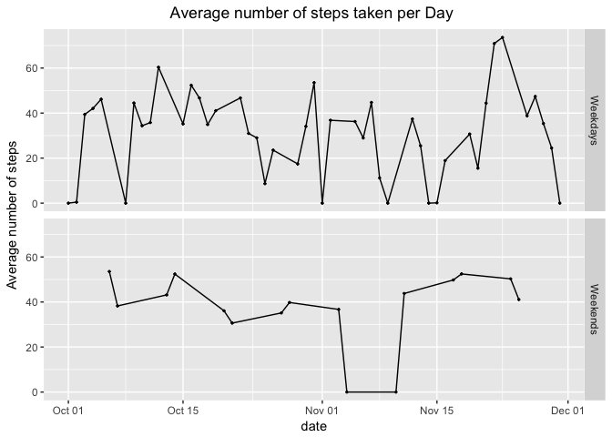

### Code for reading in the dataset and/or processing the data, load libraries needed


```r
setwd("~/Downloads")
 activity <-read.csv(file = "activity.csv", stringsAsFactors = FALSE) 
  library(dplyr)
```

```
## Warning: package 'dplyr' was built under R version 3.2.5
```

```
## 
## Attaching package: 'dplyr'
```

```
## The following objects are masked from 'package:stats':
## 
##     filter, lag
```

```
## The following objects are masked from 'package:base':
## 
##     intersect, setdiff, setequal, union
```
### Code to sum steps at daily level

```r
 library(dplyr)
 dailySteps <- activity %>%
   select(date, steps) %>%
   group_by(date) %>%
   summarise(steps = sum(steps, na.rm = TRUE))
```

### Histogram of total daily steps

```r
 plot1 <-(hist(dailySteps$steps,
                  xlab="", ylab = "Steps",
                  main="Histogram of Activity Monitoring",
                  col = "blue"))
```

<!-- -->

### Code to calcualte Mean and Median Steps per Day


```r
 dailyAvgSteps <- activity %>%
   select(date, steps) %>%
   group_by(date) %>%
   summarise(mean_steps = mean(steps, na.rm = TRUE),
             median_steps = median(steps, na.rm = TRUE))
dailyAvgSteps
```

```
## # A tibble: 61 × 3
##          date mean_steps median_steps
##         <chr>      <dbl>        <dbl>
## 1  2012-10-01        NaN           NA
## 2  2012-10-02    0.43750            0
## 3  2012-10-03   39.41667            0
## 4  2012-10-04   42.06944            0
## 5  2012-10-05   46.15972            0
## 6  2012-10-06   53.54167            0
## 7  2012-10-07   38.24653            0
## 8  2012-10-08        NaN           NA
## 9  2012-10-09   44.48264            0
## 10 2012-10-10   34.37500            0
## # ... with 51 more rows
```


# TIME SERIES PLOT FOR AVERAGES

```r
 plotAvg <- (barplot(dailyAvgSteps$mean_steps,
                    names.arg = dailyAvgSteps$date,
                    xlab="", ylab = "Steps",
                    main = "Average Daily Steps Oct - Nov 2012",
                    col = "orange"))
```

<!-- -->

# Code to fund max steps 5 minute interval


```r
 maxInterval <- activity[which(activity$steps == max(activity$steps, na.rm = TRUE)),'interval']
 message <-paste0("Interval with most steps is interval #",maxInterval)
```

# Interval with the most steps

```
## [1] "Interval with most steps is interval #615"
```
# Code to describe and show a strategy for imputing missing data

```r
activity2 <- activity
 # create a second data set, 
 # Data imputation - if steps is NA, make it 0
 activity2$steps <- ifelse(is.na(activity2$steps),0,activity2$steps)
```

# Histogram of the total number of steps taken each day after missing values are imputed

```r
 dailySteps2 <- activity2 %>%
   select(date, steps) %>%
   group_by(date) %>%
   summarise(steps = sum(steps, na.rm = TRUE))
 
 
 # Histogram/Bar Plot
 plotImp <- (hist(dailySteps2$steps,
                 main="Histogram of Activity Monitoring (Imputed)",
                  xlab="Date", ylab = "Frequency",
                  col = "green"))
```

<!-- -->

# Panel plot comparing the average number of steps taken per 5-minute interval across weekdays and weekends 


```r
#convert date to actual data format 
 dailyAvgSteps2 <- activity2 %>%
   select(date, steps) %>%
   group_by(date) %>%
   summarise(mean_steps = mean(steps, na.rm = TRUE),
             median_steps = median(steps, na.rm = TRUE))
 
 dailyAvgSteps2$date <-  as.Date(dailyAvgSteps2$date, '%Y-%m-%d')
 
 dailyAvgSteps2$dow <- weekdays(dailyAvgSteps2$date)

 #split the data set in to weekdays and weekends
 #split the data set in to weekdays and weekends
 weekdays <- dailyAvgSteps2[which(dailyAvgSteps2$dow %in% c('Monday','Tuesday','Wednesday','Thursday','Friday')),]
 weekdays$dayType <- 'Weekdays'
 weekends <- dailyAvgSteps2[which(dailyAvgSteps2$dow %in% c('Saturday','Sunday')),]
 weekends$dayType <- 'Weekends'

 allDays <- rbind(weekdays, weekends)
 #panel plot weekend vs. weekdays
 library(ggplot2)
dayplot <- (ggplot(allDays, aes(date, mean_steps)) 
 + geom_line()
 + geom_point(size=0.5)
 + labs(y = 'Average number of steps')
 + labs(title = "Average number of steps taken per Day ") # add a title
 + theme(plot.title = element_text(hjust = 0.5)) # center the title
 + facet_grid(dayType ~ .))
 print(dayplot)
```

<!-- -->


